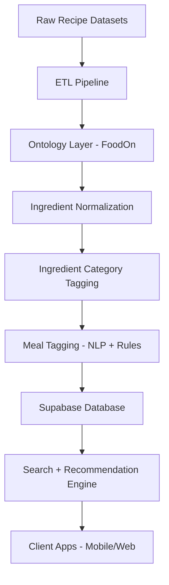

# 🍽️ Meal-Taxonomy  
### *The Intelligence Layer for Indian Meals, Recipes & Personalized Food Recommendations*

## 📌 Overview
Meal‑Taxonomy is a full-stack **knowledge graph + ontology-powered ETL engine** built to understand **Indian food**, its **ingredients**, **regional variations**, **meal types**, **nutritional patterns**, and **user cooking behavior**.

This project powers a "Netflix-for-Food" experience using:
- Ontologies (FoodOn)
- NLP Tagging (HuggingFace TASTEset NER)
- Recipe datasets (Kaggle Indian Foods, RecipeDB, FKG)
- Category root discovery
- Semantic search
- Supabase backend

---

# 🧭 Vision & Purpose
The goal is to enable Indian households — especially working women, mothers, and household cooks — to:
- Plan meals intelligently  
- Balance nutrition  
- Discover new recipes  
- Automate meal suggestions  
- Get personalized recommendations  
- Understand their cooking patterns  
- Maintain variety & health balance  

This is achieved using:
- Ingredient taxonomy  
- Meal tagging  
- Ontology graph traversal  
- NLP extraction  
- Semantic embeddings (future)  
- Meal similarity graph  

---

# 🧩 Core Features

| Feature | Description |
|--------|-------------|
| **Ontology Import (FoodOn)** | Converts global food ontology into Supabase knowledge graph |
| **Ingredient Normalization** | Maps synonyms → canonical ingredient → FoodOn node |
| **Ingredient Category Tagging** | Grain, Pulse, Vegetable, Dairy, Meat, Spice, etc |
| **Meal Tagging** | Cuisine, region, taste, cooking method, complexity, meal time |
| **NLP Tagging** | TASTEset NER extracts diet, taste, cooking process, time |
| **ETL Pipelines** | Kaggle → Clean → Tag → Insert into Supabase |
| **Search & Recommendation** | Filter meals by category, time, region, taste, health |

---

# 🏗️ Architecture Diagram



---

# 🗂️ Repo Structure

```
meal-taxonomy/
  ├── scripts/
  │     ├── etl_run.py
  │     ├── debug_foodon_categories.py
  │     └── import_foodon_graph.py
  ├── src/
  │   └── meal_taxonomy/
  │         ├── nlp/
  │         ├── etl/
  │         ├── ontologies/
  │         ├── db/
  │         └── utils/
  ├── data/
  ├── README.md
  ├── CONTRIBUTING.md
  ├── SYSTEM_DESIGN.md
  ├── API_DOCS.md
  └── ARCHITECTURE.md
```

---

# 📐 Ingredient Category Roots (Indian Context)

| Root | Examples | Purpose |
|------|----------|----------|
| staple_grain | rice, roti, millets | satiety, carbs |
| pulse_legume | dal, rajma, chole | protein for veg households |
| vegetable | sabzi veg, leafy greens | micronutrients |
| fruit | banana, mango | snacks & desserts |
| dairy | paneer, ghee, curd | fat & protein |
| egg | omelette, egg curry | quick protein |
| meat | chicken, mutton | non‑veg dietary habits |
| seafood | fish, prawns | coastal diets |
| oil_fat | oils, butter | health patterns |
| nut_seed | cashew, almond | high-nutrient |
| spice_condiment | masalas | taste profile |
| sweetener | sugar, jaggery | diabetic lens |

---

# 🧪 NLP Tagging
- Uses **dmargutierrez/distilbert-base-uncased-TASTESet-ner**
- Extracts:
  - DIET: vegetarian, vegan, Jain  
  - PROCESS: frying, tempering, steaming  
  - TASTE: spicy, sweet, tangy  
  - TIME: “cook 10 minutes”  
- Converts into tags → Supabase

---

# 🛢️ Supabase Schema (Simplified)

| Table | Purpose |
|-------|---------|
| **meals** | main meals/recipes |
| **ingredients** | normalized ingredients |
| **meal_ingredients** | mapping table |
| **tag_types** | category of tag |
| **tags** | actual tag value |
| **meal_tags** | meal ↔ tag mapping |
| **ontology_nodes** | FoodOn nodes |
| **ontology_relations** | graph edges |
| **entity_ontology_links** | ingredient → ontology term |

---

# 📝 Contributing
See **CONTRIBUTING.md**

---

# 🧩 System Design
See **SYSTEM_DESIGN.md**

---

# 🔌 API Docs
See **API_DOCS.md**

---

# 🧱 Architecture Document
See **ARCHITECTURE.md**

---

# ❤️ Author
**Ankit Mittal**  
AI Product Manager  
India  

