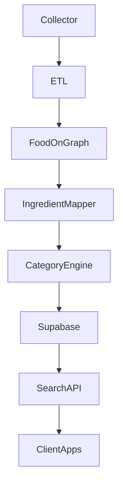

# 🧩 System Design – Meal-Taxonomy

## 1. Goals
- Build unified knowledge graph for Indian meals
- Tag every meal with categories + health signals
- Support meal planning & personalization
- Enable multi-language NLP tagging

## 2. High-Level System

## 3. Modules
- **ETL**: dataset ingestion  
- **Ontology Importer**: FoodOn OWL → DB  
- **NLP Engine**: TASTEset-based extraction  
- **Category Engine**: graph traversal  
- **Search Layer**: RPC & SQL  

## 4. Data Flow
1. Read dataset  
2. Normalize ingredients  
3. Link to ontology  
4. Derive categories  
5. Tag meals  
6. Upload to DB  

